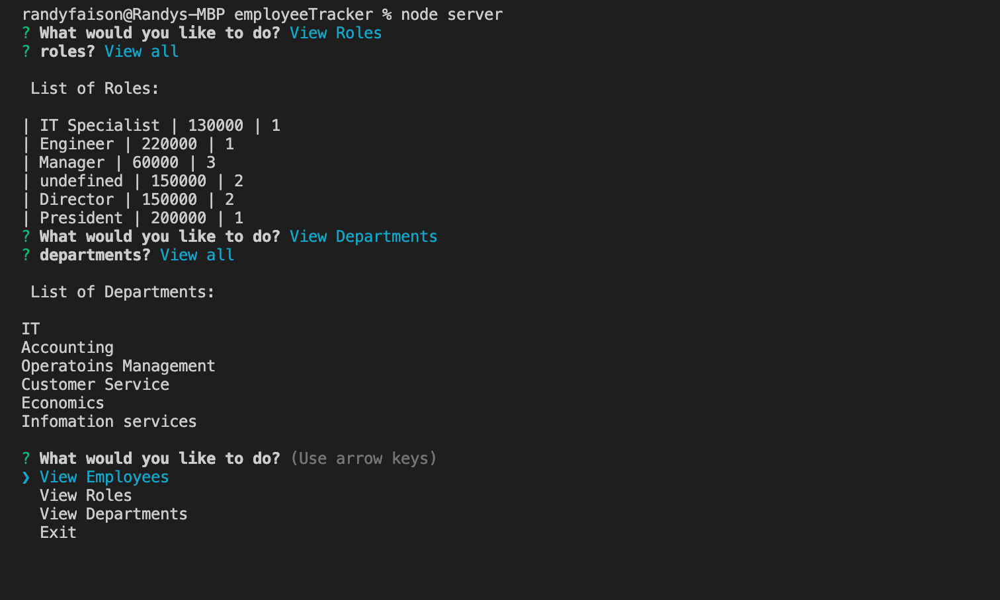

# Unit 12 MySQL Homework: Employee Tracker

Developers are often tasked with creating interfaces that make it easy for non-developers to view and interact with information stored in databases. Often these interfaces are known as **C**ontent **M**anagement **S**ystems. In this assignment, a solution was built for managing a company's employees using node, inquirer, and MySQL.


```
As a business owner
I want to be able to view and manage the departments, roles, and employees in my company
So that I can organize and plan my business
```


Link to Demo:

<a href="https://randynotetaker.herokuapp.com" >Employee-Tracker<a>


The following image shows the appearance of the application: 



Link to GitHub Repository:

<a href="https://randynotetaker.herokuapp.com" >GitHub<a>

